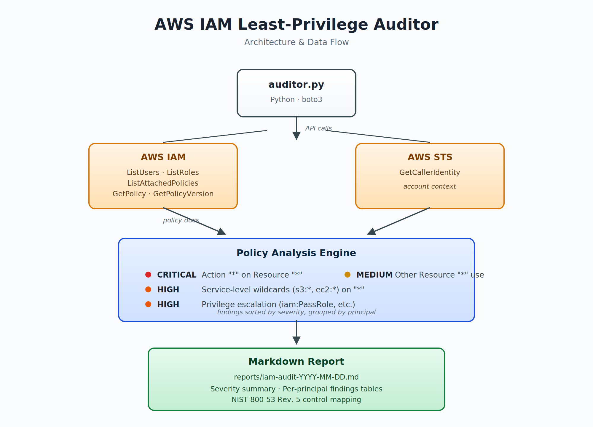

# AWS IAM Least-Privilege Auditor

A Python tool that scans AWS IAM users and roles for over-permissioned policies, identifies privilege escalation paths, and generates a Markdown compliance report aligned to NIST 800-53 Rev. 5 access control families.

Built to demonstrate Identity & Access Management (IAM) engineering skills relevant to federal and DoD cloud security roles — including least-privilege enforcement, policy analysis, and audit-driven reporting.

---

## Architecture



The auditor uses `boto3` to query AWS IAM and STS, walks every Allow statement in attached and inline policies, applies a rules engine against known risky patterns, and emits a timestamped Markdown report into the `reports/` directory.

---

## Features

- **Enumerates all IAM users and roles** in the account (skipping AWS service-linked roles)
- **Pulls both managed and inline policies** and resolves managed policy documents via their default version
- **Detects four classes of misconfiguration:**
  - `CRITICAL` — Full administrative access (`Action: "*"` on `Resource: "*"`)
  - `HIGH` — Service-level wildcards (`s3:*`, `ec2:*`) on `Resource: "*"`
  - `HIGH` — Privilege escalation paths (`iam:PassRole`, `iam:CreateRole`, etc. on `Resource: "*"`)
  - `MEDIUM` — Other wildcard resource use
- **Generates a Markdown report** with severity summary, per-principal findings tables, and NIST 800-53 control mapping
- **Handles AWS API pagination** for accounts with large IAM populations
- **Escapes Markdown special characters** so wildcards and pipes render correctly in tables

---

## Sample Output

A scan against the test environment in this repo produces findings like:

| Severity | Principal | Policy | Issue |
|----------|-----------|--------|-------|
| CRITICAL | `dev-user-bad` | AdministratorAccess | Full admin: `*` on `*` |
| HIGH | `ec2-overprivileged-role` | custom | Privilege escalation: `iam:PassRole` on `*` |
| HIGH | `s3-fullaccess-role` | AmazonS3FullAccess | Service wildcard: `s3:*` on `*` |
| MEDIUM | `legacy-unused-role` | AmazonEC2ReadOnlyAccess | Wildcard resource on read actions |

See [`reports/`](./reports) for full generated reports.

---

## Setup

### Prerequisites

- Python 3.10 or later
- An AWS account with IAM read permissions (an IAM user with `IAMReadOnlyAccess` is sufficient)
- AWS CLI configured (`aws configure`) with credentials

### Install

```bash
git clone https://github.com/mohammedkeita/aws-iam-auditor.git
cd aws-iam-auditor
python3 -m venv venv
source venv/bin/activate
pip install -r requirements.txt
```

### Run

```bash
python auditor.py
```

A timestamped report will be written to `reports/iam-audit-YYYY-MM-DD.md`.

---

## How It Works

The auditor pipeline runs in three phases:

**1. Discovery.** Paginated calls to `iam:ListUsers` and `iam:ListRoles` enumerate every principal in the account. Service-linked roles (prefixed `AWSServiceRoleFor`) are excluded because they're managed by AWS itself.

**2. Policy resolution.** For each principal, both attached managed policies and inline policies are pulled. Managed policies require a two-step fetch (`GetPolicy` → `GetPolicyVersion`) to retrieve the actual JSON document of the default version.

**3. Statement analysis.** Each `Allow` statement is evaluated against four rule classes ordered by severity. The check for full `*:*` admin short-circuits on match; remaining rules can compound (one statement may produce multiple findings if it triggers more than one rule).

Findings are sorted by severity, grouped by principal, and rendered as Markdown tables with escaped special characters.

---

## NIST 800-53 Rev. 5 Control Mapping

This auditor supports assessment of the following controls:

| Control | Family | Description |
|---------|--------|-------------|
| AC-2 | Access Control | Account Management — enumerates and documents user/role inventory |
| AC-3 | Access Control | Access Enforcement — detects overly permissive Allow statements |
| AC-6 | Access Control | Least Privilege — flags wildcard actions and resources |
| AU-2 | Audit & Accountability | Event Logging — output supports audit recordkeeping |
| AU-6 | Audit & Accountability | Audit Review — produces reviewable findings with severity |
| CM-7 | Configuration Management | Least Functionality — surfaces unneeded permissions |

---

## Project Structure

aws-iam-auditor/
├── auditor.py              # Main script: discovery, analysis, reporting
├── requirements.txt        # Python dependencies (boto3)
├── architecture.png        # Architecture diagram
├── test-environment.md     # Documentation of intentionally vulnerable test resources
├── reports/                # Generated audit reports (Markdown)
│   └── iam-audit-*.md
└── README.md

---

## Test Environment

To validate the auditor's detection capabilities, the IAM environment for this project was seeded with four deliberately misconfigured resources. See [`test-environment.md`](./test-environment.md) for details on each resource and the expected finding it should generate.

---

## Future Improvements

This is a focused first version. Reasonable next steps:

- **AWS IAM Access Analyzer integration** to incorporate unused-access findings into the report
- **JSON output mode** for machine consumption and pipeline integration
- **Multi-account scanning** via assumed roles across an AWS Organization
- **Custom rule definitions** loaded from a YAML config file instead of hardcoded constants
- **CloudWatch / Security Hub publishing** so findings flow into existing security monitoring
- **Terraform module** to deploy the auditor on a schedule via Lambda + EventBridge
- **HTML report output** with collapsible sections for very large accounts

---

## Author

**Mohammed Keita**
Aspiring cloud security engineer focused on AWS IAM, Zero Trust architecture, and federal compliance frameworks.

- GitHub: [@mohammedkeita](https://github.com/mohammedkeita)
- LinkedIn: [Mohammed Keita](https://www.linkedin.com/in/mohammed-keitaa)
---

## License

MIT